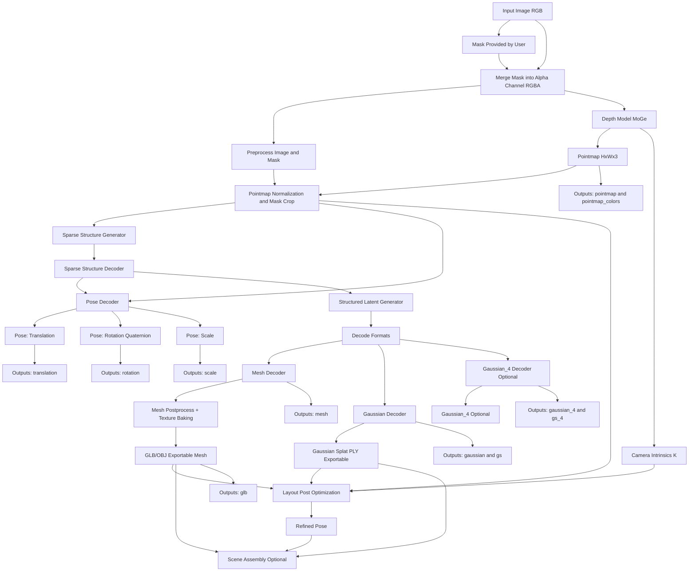

# SAM 3D Objects Pipeline Graph

Notes:
- `Mask Provided by User` is required; there is no built-in segmentation step in this pipeline.
- `Camera Intrinsics (K)` are taken from MoGe if available; otherwise inferred from the pointmap.
- `Layout Post-Optimization` is optional and can refine pose using mask, pointmap, and intrinsics.
