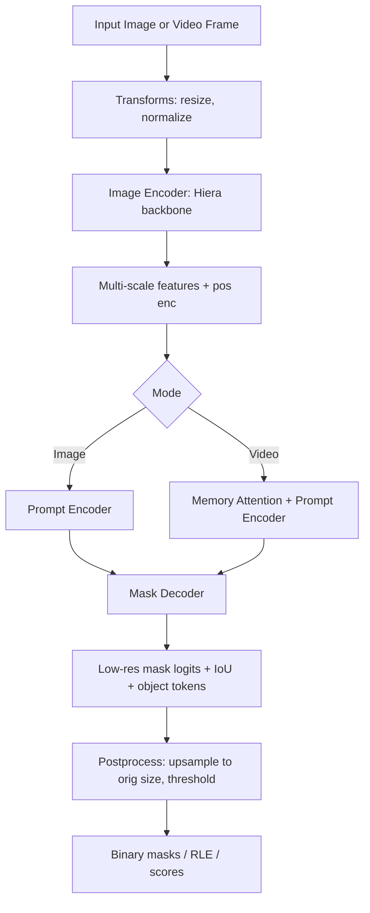
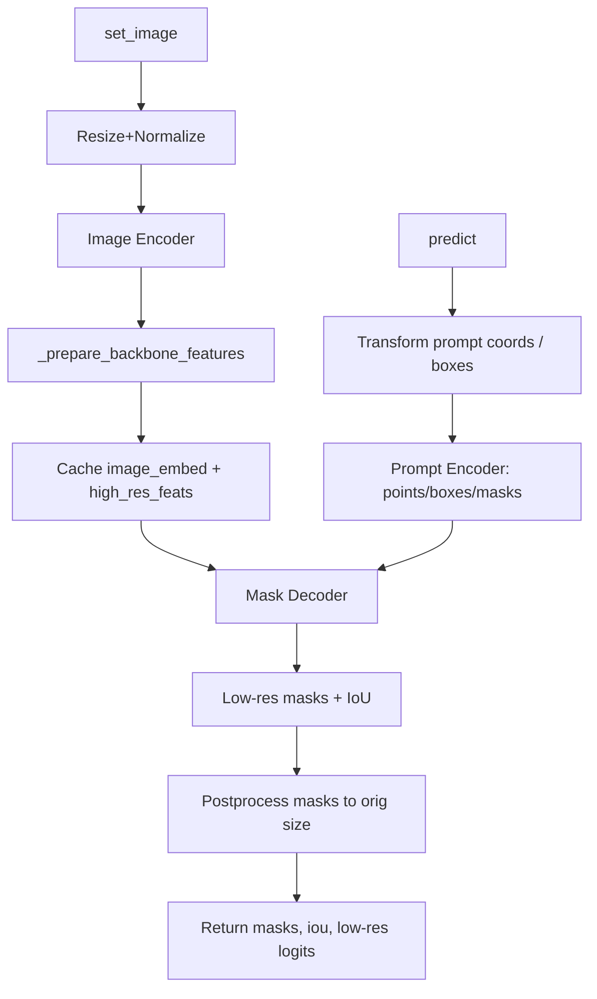
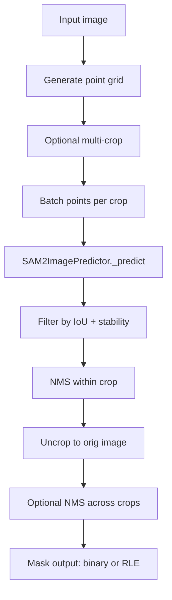
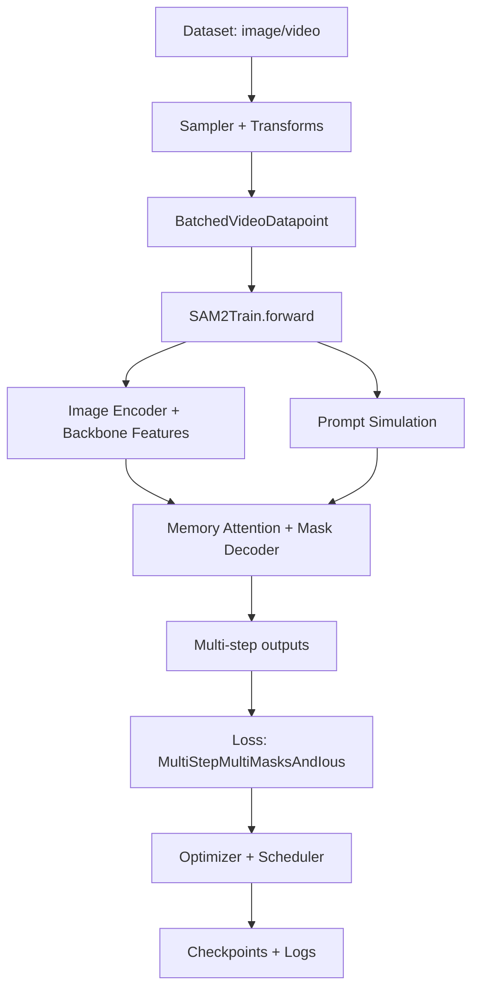
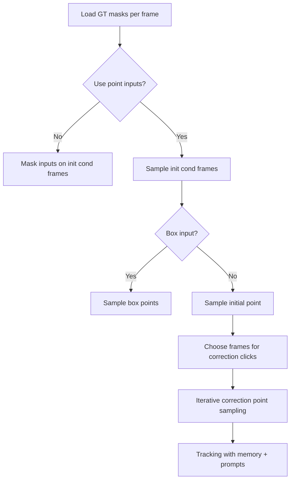
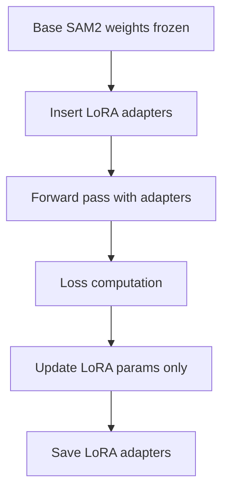

# SAM 2 Pipeline Analysis, Block Diagram, and Usage Examples

This document summarizes the SAM 2 codebase in this repo and provides a full end‑to‑end pipeline view with practical usage examples, including mask export for each detected object. It is based entirely on the local code in this workspace.

**Sources in this repo**: `sam2/build_sam.py`, `sam2/modeling/sam2_base.py`, `sam2/modeling/backbones/hieradet.py`, `sam2/modeling/memory_attention.py`, `sam2/modeling/memory_encoder.py`, `sam2/modeling/sam/prompt_encoder.py`, `sam2/modeling/sam/mask_decoder.py`, `sam2/sam2_image_predictor.py`, `sam2/automatic_mask_generator.py`, `sam2/sam2_video_predictor.py`, `sam2/utils/transforms.py`, `sam2/utils/misc.py`, `sam2/utils/amg.py`, `notebooks/*_example.ipynb`.

**Scope**: This is an inference‑centric analysis (image, automatic mask generation, video tracking). Training is referenced but not deep‑dived.


**Code Map (What Each Block Does)**

- `sam2/build_sam.py`: Model factory. Uses Hydra config + checkpoint to instantiate `SAM2Base` or `SAM2VideoPredictor`. Applies post‑processing options and optional VOS optimization. Also provides HF download helpers.
- `sam2/modeling/sam2_base.py`: Core model wiring. Defines the image encoder, memory attention, memory encoder, SAM‑style prompt encoder, SAM‑style mask decoder, and the data flow for producing masks and object pointers.
- `sam2/modeling/backbones/hieradet.py`: Hiera backbone (image encoder). Produces multi‑scale feature maps with positional embeddings.
- `sam2/modeling/memory_attention.py`: Memory attention transformer that fuses current frame features with memory features from previous frames.
- `sam2/modeling/memory_encoder.py`: Encodes previous masks + features into memory tokens (mask memory bank).
- `sam2/modeling/sam/prompt_encoder.py`: Encodes point, box, and mask prompts into sparse + dense embeddings.
- `sam2/modeling/sam/mask_decoder.py`: Two‑way transformer and hypernetwork heads that output mask logits, IoU estimates, and object tokens.
- `sam2/sam2_image_predictor.py`: Image‑only predictor with cached image embeddings and simple `predict` API.
- `sam2/automatic_mask_generator.py`: Grid‑prompt mask generator with filtering, NMS, optional multi‑crop, and RLE output.
- `sam2/sam2_video_predictor.py`: Video predictor with inference state, interaction APIs, memory propagation, and per‑frame outputs.
- `sam2/utils/transforms.py`: Image normalization, resizing, coordinate transforms, and post‑processing of masks.
- `sam2/utils/misc.py`: Video frame loading + other utilities.
- `sam2/utils/amg.py`: Helper ops used by automatic mask generator (NMS, RLE, cropping, stability score, etc).


**Pipeline Diagrams**

**1) Overall Inference Architecture**



**2) Image Predictor Pipeline**



**3) Automatic Mask Generation (AMG) Pipeline**



**4) Video Predictor Pipeline**

```mermaid
flowchart TD
  A[init_state] --> B[Load frames: mp4 or JPEG folder]
  B --> C[Cache frame0 features]

  D[add_new_points_or_box / add_new_mask] --> E[Run single‑frame SAM]
  E --> F[Store cond outputs + temp outputs]

  G[propagate_in_video] --> H[Consolidate temp outputs]
  H --> I[For each frame: memory‑conditioned features]
  I --> J[Mask Decoder for each object]
  J --> K[Memory Encoder to update memory bank]
  K --> L[Upsample masks to orig video size]
  L --> M[Yield (frame_idx, obj_ids, masks)]
```


**Detailed Block Behavior (from code)**

**Image Encoder (Hiera)**
- Produces multi‑scale feature maps with positional encodings.
- Used by both image and video pipelines. See `sam2/modeling/backbones/hieradet.py` and `sam2/modeling/sam2_base.py:forward_image`.

**Prompt Encoder**
- Accepts points (pos/neg), boxes (converted to two point tokens), and masks.
- Returns sparse embeddings (points + boxes) and dense embeddings (mask prompt). See `sam2/modeling/sam/prompt_encoder.py`.

**Mask Decoder**
- Two‑way transformer + hypernetworks, outputs low‑res mask logits, IoU predictions, and SAM tokens (object pointers). See `sam2/modeling/sam/mask_decoder.py`.

**Memory Encoder + Memory Attention (Video)**
- Memory encoder fuses previous masks with pixel features into memory tokens. See `sam2/modeling/memory_encoder.py`.
- Memory attention cross‑attends current features to memory tokens (and optional object pointers). See `sam2/modeling/memory_attention.py` and `sam2/modeling/sam2_base.py:_prepare_memory_conditioned_features`.

**Post‑processing**
- Converts low‑res logits to full‑res masks, optionally fills holes/removes sprinkles via CUDA extension. See `sam2/utils/transforms.py`.


**Usage Examples (End‑to‑End)**

**Example 1: Build model from local checkpoint (image)**

```python
import torch
from sam2.build_sam import build_sam2
from sam2.sam2_image_predictor import SAM2ImagePredictor

checkpoint = "./checkpoints/sam2.1_hiera_large.pt"
model_cfg = "configs/sam2.1/sam2.1_hiera_l.yaml"

sam2 = build_sam2(model_cfg, checkpoint, device="cuda")
predictor = SAM2ImagePredictor(sam2)
```

**Example 2: Build model from Hugging Face (image)**

```python
from sam2.sam2_image_predictor import SAM2ImagePredictor

predictor = SAM2ImagePredictor.from_pretrained("facebook/sam2.1-hiera-large", device="cuda")
```

**Example 3: Image predictor with point prompt**

```python
import numpy as np
from PIL import Image

image = np.array(Image.open("./assets/sa_v_dataset.jpg").convert("RGB"))

predictor.set_image(image)
points = np.array([[300, 200]])
labels = np.array([1])  # 1 = foreground
masks, ious, low_res_logits = predictor.predict(points, labels, multimask_output=True)
```

**Example 4: Image predictor with box prompt**

```python
box = np.array([120, 80, 420, 380])  # XYXY
masks, ious, low_res_logits = predictor.predict(box=box, multimask_output=True)
```

**Example 5: Image predictor with iterative refinement**

```python
# First pass
masks, ious, low_res_logits = predictor.predict(points, labels, multimask_output=True)

# Use best mask logits as mask prompt for refinement
best_idx = ious.argmax()
mask_input = low_res_logits[best_idx][None, :, :]

masks_refined, ious_refined, _ = predictor.predict(
    points, labels, mask_input=mask_input, multimask_output=False
)
```

**Example 6: Batch image prediction**

```python
import numpy as np

images = [np.array(Image.open(p).convert("RGB")) for p in ["a.jpg", "b.jpg"]]

predictor.set_image_batch(images)

points_batch = [np.array([[100, 120]]), np.array([[300, 250]])]
labels_batch = [np.array([1]), np.array([1])]

masks_list, ious_list, low_res_list = predictor.predict_batch(
    point_coords_batch=points_batch,
    point_labels_batch=labels_batch,
    multimask_output=True,
)
```

**Example 7: Automatic mask generation (default)**

```python
from sam2.build_sam import build_sam2
from sam2.automatic_mask_generator import SAM2AutomaticMaskGenerator

sam2 = build_sam2("configs/sam2.1/sam2.1_hiera_l.yaml", "./checkpoints/sam2.1_hiera_large.pt")
mask_generator = SAM2AutomaticMaskGenerator(sam2)

image = np.array(Image.open("./assets/sa_v_dataset.jpg").convert("RGB"))
anns = mask_generator.generate(image)
# anns is a list of dicts: segmentation, bbox, area, predicted_iou, stability_score, crop_box
```

**Example 8: Automatic mask generation with multi‑crop and RLE output**

```python
mask_generator = SAM2AutomaticMaskGenerator(
    sam2,
    points_per_side=32,
    crop_n_layers=1,
    crop_overlap_ratio=0.6,
    output_mode="coco_rle",
)
anns = mask_generator.generate(image)
```

**Example 9: Video predictor basic usage**

```python
from sam2.build_sam import build_sam2_video_predictor

checkpoint = "./checkpoints/sam2.1_hiera_large.pt"
model_cfg = "configs/sam2.1/sam2.1_hiera_l.yaml"

predictor = build_sam2_video_predictor(model_cfg, checkpoint, device="cuda")
state = predictor.init_state("/path/to/video.mp4")

# add a click on frame 0 for object id 1
frame_idx = 0
obj_id = 1
points = [[300, 200]]
labels = [1]

predictor.add_new_points_or_box(state, frame_idx, obj_id, points=points, labels=labels)

for frame_idx, obj_ids, masks in predictor.propagate_in_video(state):
    # masks shape: [num_objects, H, W] at original video resolution
    pass
```

**Example 10: Video predictor with box prompt**

```python
box = [120, 80, 420, 380]
predictor.add_new_points_or_box(state, frame_idx=0, obj_id=1, box=box)
```

**Example 11: Video predictor with mask prompt**

```python
# mask_prompt: torch.Tensor of shape [H, W] or [1, H, W]
mask_prompt = (masks_from_other_model > 0).astype("float32")

predictor.add_new_mask(
    state,
    frame_idx=0,
    obj_id=1,
    mask=mask_prompt,
)
```

**Example 12: VOS‑optimized video predictor**

```python
predictor = build_sam2_video_predictor(
    model_cfg, checkpoint, device="cuda", vos_optimized=True
)
state = predictor.init_state("/path/to/video_frames_dir")
```

**Example 13: Offloading video frames / state to CPU**

```python
state = predictor.init_state(
    "/path/to/video.mp4",
    offload_video_to_cpu=True,
    offload_state_to_cpu=True,
)
```


**Export Masks for Each Detected Object (Examples)**

These examples show how to save per‑object masks to disk. Use one pattern depending on the pipeline you run.

**A) Export masks from automatic mask generator (image)**

```python
import os
import json
import numpy as np
from PIL import Image

out_dir = "./mask_exports"
os.makedirs(out_dir, exist_ok=True)

anns = mask_generator.generate(image)

records = []
for i, ann in enumerate(anns):
    mask = ann["segmentation"]  # binary HxW numpy array if output_mode='binary_mask'
    mask_img = (mask.astype(np.uint8) * 255)
    mask_path = os.path.join(out_dir, f"mask_{i:04d}.png")
    Image.fromarray(mask_img).save(mask_path)

    records.append({
        "mask_path": mask_path,
        "bbox": ann["bbox"],
        "area": ann["area"],
        "predicted_iou": ann["predicted_iou"],
        "stability_score": ann["stability_score"],
        "point_coords": ann["point_coords"],
        "crop_box": ann["crop_box"],
    })

with open(os.path.join(out_dir, "masks.json"), "w") as f:
    json.dump(records, f, indent=2)
```

**B) Export masks from image predictor (single image, multiple masks)**

```python
import os
import numpy as np
from PIL import Image

masks, ious, _ = predictor.predict(points, labels, multimask_output=True)

out_dir = "./image_masks"
os.makedirs(out_dir, exist_ok=True)

for i in range(masks.shape[0]):
    mask_img = (masks[i].astype(np.uint8) * 255)
    Image.fromarray(mask_img).save(os.path.join(out_dir, f"mask_{i:02d}.png"))
```

**C) Export masks per object and per frame (video)**

```python
import os
import numpy as np
from PIL import Image

out_dir = "./video_masks"
os.makedirs(out_dir, exist_ok=True)

for frame_idx, obj_ids, masks in predictor.propagate_in_video(state):
    # masks shape: [num_objects, H, W]
    for obj_i, obj_id in enumerate(obj_ids):
        obj_dir = os.path.join(out_dir, f"obj_{obj_id}")
        os.makedirs(obj_dir, exist_ok=True)
        mask = masks[obj_i]
        mask_img = (mask.astype(np.uint8) * 255)
        Image.fromarray(mask_img).save(
            os.path.join(obj_dir, f"frame_{frame_idx:05d}.png")
        )
```


**Practical Notes and Gotchas**

- `SAM2ImagePredictor.set_image(...)` caches embeddings. Call it once per image, then reuse `predict(...)` for multiple prompts.
- Coordinates in `predict(...)` are pixel space by default. Set `normalize_coords=True` only if you pass normalized inputs.
- `SAM2AutomaticMaskGenerator` can output masks as binary arrays or RLEs. For large images, RLE is usually more memory‑efficient.
- In video mode, add prompts first (`add_new_points_or_box` or `add_new_mask`) and only then call `propagate_in_video`.
- For very long videos, `offload_video_to_cpu=True` helps reduce GPU memory usage.

**Training Pipeline (Blocks and Data Flow)**

- Training entrypoints and orchestration live under `training/`, especially `training/train.py` and `training/trainer.py`.
- The training model is `training/model/sam2.py::SAM2Train`, which subclasses `sam2/modeling/sam2_base.py::SAM2Base`.
- Losses are defined in `training/loss_fns.py` (main loss class: `MultiStepMultiMasksAndIous`).
- Optimizer utilities and schedulers are in `training/optimizer.py`.
- Dataset and transforms live under `training/dataset/`.
- The training README assumes A100 80GB GPUs for the provided MOSE fine‑tuning example.



**Training Prompt Simulation (Blocks)**



**Training Example Command (from `training/README.md`)**

The config file path on disk is `sam2/configs/sam2.1_training/sam2.1_hiera_b+_MOSE_finetune.yaml`. The training README uses the Hydra config name `configs/sam2.1_training/sam2.1_hiera_b+_MOSE_finetune.yaml` in its example command.

```bash
python training/train.py \
  -c configs/sam2.1_training/sam2.1_hiera_b+_MOSE_finetune.yaml \
  --use-cluster 0 \
  --num-gpus 8
```

**LoRA Fine‑Tuning (Custom Extension, Not in Repo)**

The current repo does not implement LoRA adapters. If you want LoRA fine‑tuning, you need to add it yourself. A minimal plan is:

- Choose target layers to adapt, for example attention/MLP linear layers in the image encoder (`sam2/modeling/backbones/`), mask decoder (`sam2/modeling/sam/mask_decoder.py`), and memory attention (`sam2/modeling/memory_attention.py`).
- Wrap those linear layers with LoRA modules, freeze the base weights, and train only LoRA parameters.
- Update optimizer parameter filtering to include only LoRA params.
- Save adapter weights separately or merge them into base weights for inference.



If you want, I can implement a concrete LoRA patch inside this repo and wire it into `training/` and `build_sam.py`.

**Legacy Predictor**

- There is a legacy video predictor in `sam2/sam2_video_predictor_legacy.py`. The main pipeline uses `sam2/sam2_video_predictor.py`.


**Next Steps**

If you want, I can also generate:

1. A minimal runnable script with CLI arguments for image or video processing.
2. A visual diagram (SVG/PNG) generated from the Mermaid graphs.
3. A tailored pipeline focusing only on your notebook `notebooks/automatic_mask_generator_example.ipynb`.
